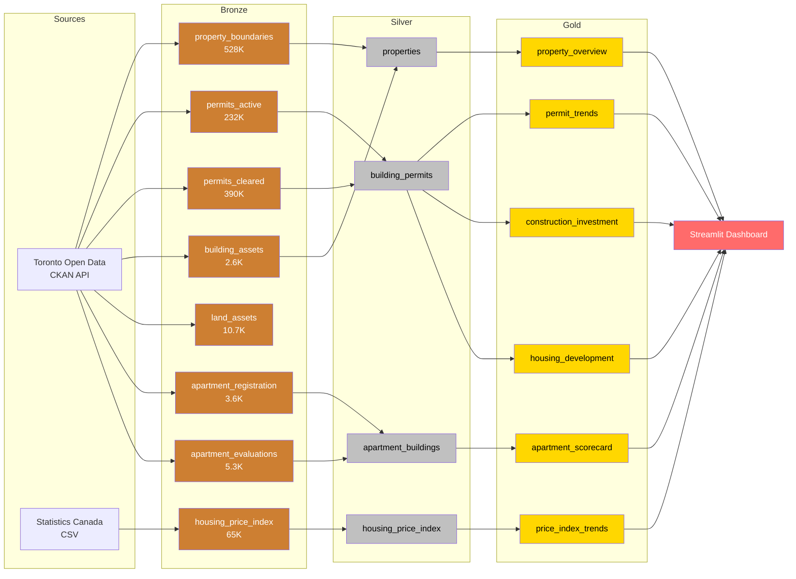

# Ontario Real Estate Data Engineering Project

Production-grade data engineering pipeline using **Medallion Architecture** (Bronze/Silver/Gold) for Ontario real estate analytics. Built with **PySpark**, **Delta Lake**, and **Databricks**, visualized through a **Streamlit** dashboard.

## Data Sources (1.2M+ Real Records)

| Source | Dataset | Records | Licence |
|--------|---------|---------|---------|
| [Toronto Open Data](https://open.toronto.ca) | Property Boundaries | ~528K | Open Government Licence - Toronto |
| [Toronto Open Data](https://open.toronto.ca) | Building Permits (Active) | ~232K | Open Government Licence - Toronto |
| [Toronto Open Data](https://open.toronto.ca) | Building Permits (Cleared) | ~390K | Open Government Licence - Toronto |
| [Toronto Open Data](https://open.toronto.ca) | Building Asset Inventory | ~2.6K | Open Government Licence - Toronto |
| [Toronto Open Data](https://open.toronto.ca) | Land Asset Inventory | ~10.7K | Open Government Licence - Toronto |
| [Toronto Open Data](https://open.toronto.ca) | RentSafeTO Registration | ~3.6K | Open Government Licence - Toronto |
| [Toronto Open Data](https://open.toronto.ca) | RentSafeTO Evaluations | ~5.3K | Open Government Licence - Toronto |
| [Statistics Canada](https://www150.statcan.gc.ca) | New Housing Price Index | ~65K | Open Government Licence - Canada |

## Architecture



## Project Structure

```
ontario_real_estate/
├── data/
│   ├── raw/                  # Downloaded source CSVs (~540MB)
│   ├── bronze/               # Delta tables (8 tables)
│   ├── silver/               # Delta tables (4 tables)
│   └── gold/                 # Delta + Parquet (6 tables)
├── notebooks/
│   ├── 00_download_data.py   # Fetch from open data APIs
│   ├── 01_bronze_ingestion.py    # Raw → Bronze (8 tables)
│   ├── 02_silver_transform.py    # Bronze → Silver (4 tables)
│   └── 03_gold_aggregation.py    # Silver → Gold (6 tables)
├── sql/
│   ├── ddl_bronze.sql
│   ├── ddl_silver.sql
│   └── ddl_gold.sql
├── streamlit_app/
│   ├── app.py                # Dashboard (6 tabs)
│   └── utils.py              # Data loaders & formatters
├── tests/
│   └── test_transforms.py    # Unit tests for transform logic
├── requirements.txt
├── .env.example
└── README.md
```

## Quick Start

### 1. Install Dependencies

```bash
pip install -r requirements.txt
```

### 2. Download Real Data

```bash
python notebooks/00_download_data.py
```

Downloads ~540MB of authentic data from Toronto Open Data and Statistics Canada.

### 3. Run the Pipeline

**Local (requires Java 8/11 + PySpark):**

```bash
cd notebooks
python 01_bronze_ingestion.py
python 02_silver_transform.py
python 03_gold_aggregation.py
```

**Databricks:**

Import `notebooks/` into your Databricks workspace via Repos. Update paths to use `/mnt/` or Unity Catalog. Run in order: 01 → 02 → 03.

### 4. Launch Dashboard

```bash
cd streamlit_app
streamlit run app.py
```

## Dashboard Tabs

| Tab | Visualizations |
|-----|---------------|
| **Permit Trends** | Yearly permit volume, breakdown by type/structure/ward |
| **Construction Investment** | Total investment trends, category breakdown, top uses |
| **Housing Development** | Net dwelling units created/lost, by structure type & ward |
| **Apartment Quality** | RentSafeTO scores, quality tiers, age vs score scatter |
| **Price Index** | StatCan NHPI: total/house/land indices, YoY change |
| **Property Overview** | 528K+ property parcels by type, average area stats |

## Silver Layer Transformations

- **Type casting**: String → Date, Double, Integer
- **Deduplication**: By parcel_id (properties), permit_number (permits), rsn (apartments)
- **Union**: Active + cleared permits into single table
- **Joins**: Apartment registration + latest evaluation scores
- **Derived columns**: net_dwelling_units, building_age, price_per_sqft, postal_prefix
- **Filtering**: Ontario-only housing price index, null/invalid record removal

## Databricks Deployment

1. Upload raw CSVs to DBFS or mounted cloud storage
2. Import notebooks via Repos
3. Run DDL scripts in `sql/` to create schemas
4. Execute notebooks: 00 → 01 → 02 → 03
5. Schedule via Databricks Workflows for production

## Licence

Data is used under:
- **Open Government Licence — Toronto** (Toronto Open Data)
- **Open Government Licence — Canada** (Statistics Canada)
